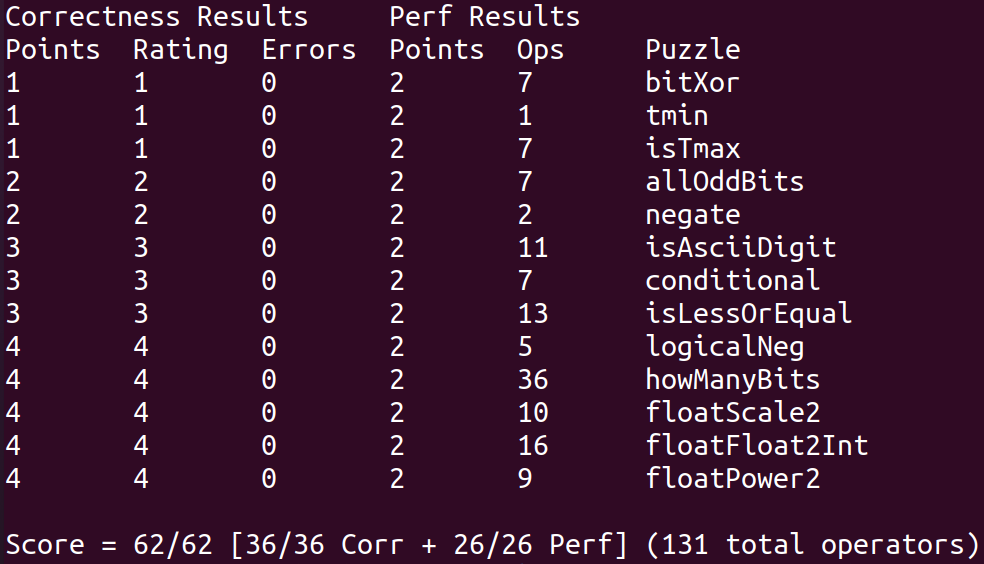

# 01 Data Lab

## 文件内容

- 项目文件：`datalab-handout`
- 相关说明教程：`guide`
- 实现代码：`bits.c`

## 题目

|        函数名         |                       描述                       | 难度级别 | 最大操作符数目 |
| :-------------------: | :----------------------------------------------: | :------: | :------------: |
|     bitXor\(x,y\)     |              x 异或 y，只用 & 和 ~               |    1     |       14       |
|       tmin\(\)        |                  最小的整数补码                  |    1     |       4        |
|      isTmax\(x\)      |             x 为最大的整数补码时为真             |    1     |       10       |
|    allOddBits\(x\)    |             x 的奇数位都为 1 时为真              |    2     |       12       |
|      negate\(x\)      |               使用 - 操作符返回 -x               |    2     |       5        |
|   isAsciDigit\(x\)    | $\small 0x30\leqslant x \leqslant 0x39$ 时为真 |    3     |       15       |
|      conditional      |                 等同于 x ? y : z                 |    3     |       16       |
| isLessOrEqual\(x, y\) |    $\small x \leqslant y$ 时为真，否则为假    |    3     |       24       |
|   logicalNeg\(x\)\)   |               不用 ! 运算符计算 !x               |    4     |       12       |
|   howManyBits\(x\)    |             用补码表示 x 的最小位数              |    4     |       90       |
|   floatScale2\(uf\)   |      对于浮点参数 f，返回 2\*f 的位级等价数      |    4     |       30       |
| floatFloat2Int\(uf\)  |   对于浮点参数 f，返回 \(int\) f 的位级等价数    |    4     |       30       |
|   floatPower2\(x\)    |              对于整数 x，返回 2.0^x              |    4     |       30       |

## 如何运行

```sh
./driver.pl
```

详见 `Instruction/writeup.md`

## 结果

