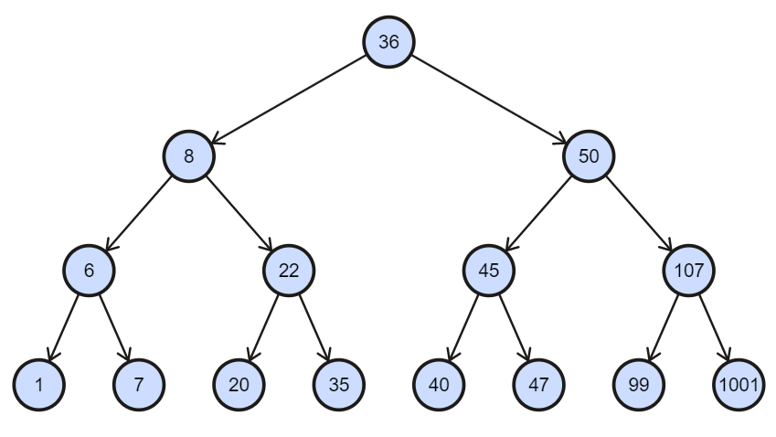

# 02 Bomb Lab

## 文件内容

- 项目文件：`bomb` 
- 相关说明教程：`Instruction`
- 其余：
    - `bomb.txt` 为反汇编内容
    - `ans.txt` 为最终答案

## 如何运行

```sh
bomb/bomb ans.txt
```

## 题目分析

炸弹内容为六个 `phase` 和一个隐藏关

### phase_1

``` assembly
0000000000400ee0 <phase_1>:
   0x0000000000400ee0 <+0>:	sub    $0x8,%rsp
   0x0000000000400ee4 <+4>:	mov    $0x402400,%esi
   0x0000000000400ee9 <+9>:	callq  0x401338 <strings_not_equal>
   0x0000000000400eee <+14>:	test   %eax,%eax
   0x0000000000400ef0 <+16>:	je     0x400ef7 <phase_1+23>
   0x0000000000400ef2 <+18>:	callq  0x40143a <explode_bomb>
   0x0000000000400ef7 <+23>:	add    $0x8,%rsp
   0x0000000000400efb <+27>:	retq
```

热身关，发现就是简单判断输入字符串是否相同，查看地址 `0x402400` 内容即可。


**答案：**`Border relations with Canada have never been better.`

### phase_2

```assembly
0000000000400efc <phase_2>:
   0x0000000000400efc <+0>:	push   %rbp
   0x0000000000400efd <+1>:	push   %rbx
   0x0000000000400efe <+2>:	sub    $0x28,%rsp
   0x0000000000400f02 <+6>:	mov    %rsp,%rsi
   0x0000000000400f05 <+9>:	callq  0x40145c <read_six_numbers>
   0x0000000000400f0a <+14>:	cmpl   $0x1,(%rsp)
   0x0000000000400f0e <+18>:	je     0x400f30 <phase_2+52>
   0x0000000000400f10 <+20>:	callq  0x40143a <explode_bomb>
   0x0000000000400f15 <+25>:	jmp    0x400f30 <phase_2+52>
   0x0000000000400f17 <+27>:	mov    -0x4(%rbx),%eax
   0x0000000000400f1a <+30>:	add    %eax,%eax
   0x0000000000400f1c <+32>:	cmp    %eax,(%rbx)
   0x0000000000400f1e <+34>:	je     0x400f25 <phase_2+41>
   0x0000000000400f20 <+36>:	callq  0x40143a <explode_bomb>
   0x0000000000400f25 <+41>:	add    $0x4,%rbx
   0x0000000000400f29 <+45>:	cmp    %rbp,%rbx
   0x0000000000400f2c <+48>:	jne    0x400f17 <phase_2+27>
   0x0000000000400f2e <+50>:	jmp    0x400f3c <phase_2+64>
   0x0000000000400f30 <+52>:	lea    0x4(%rsp),%rbx
   0x0000000000400f35 <+57>:	lea    0x18(%rsp),%rbp
   0x0000000000400f3a <+62>:	jmp    0x400f17 <phase_2+27>
   0x0000000000400f3c <+64>:	add    $0x28,%rsp
   0x0000000000400f40 <+68>:	pop    %rbx
   0x0000000000400f41 <+69>:	pop    %rbp
   0x0000000000400f42 <+70>:	retq
```

由第5行可知，本题要求输入六个数字，依次与2的幂比较，全部相等即正确。

**答案：**`1 2 4 8 16 32`

### phase_3

```assembly
0000000000400f43 <phase_3>:
   0x0000000000400f43 <+0>:	sub    $0x18,%rsp
   0x0000000000400f47 <+4>:	lea    0xc(%rsp),%rcx
   0x0000000000400f4c <+9>:	lea    0x8(%rsp),%rdx
   0x0000000000400f51 <+14>:	mov    $0x4025cf,%esi
   0x0000000000400f56 <+19>:	mov    $0x0,%eax
   0x0000000000400f5b <+24>:	callq  0x400bf0 <__isoc99_sscanf@plt>
   0x0000000000400f60 <+29>:	cmp    $0x1,%eax
   0x0000000000400f63 <+32>:	jg     0x400f6a <phase_3+39>
   0x0000000000400f65 <+34>:	callq  0x40143a <explode_bomb>
   0x0000000000400f6a <+39>:	cmpl   $0x7,0x8(%rsp)
   0x0000000000400f6f <+44>:	ja     0x400fad <phase_3+106>
   0x0000000000400f71 <+46>:	mov    0x8(%rsp),%eax
   0x0000000000400f75 <+50>:	jmpq   *0x402470(,%rax,8)
   0x0000000000400f7c <+57>:	mov    $0xcf,%eax
   0x0000000000400f81 <+62>:	jmp    0x400fbe <phase_3+123>
   0x0000000000400f83 <+64>:	mov    $0x2c3,%eax
   0x0000000000400f88 <+69>:	jmp    0x400fbe <phase_3+123>
   0x0000000000400f8a <+71>:	mov    $0x100,%eax
   0x0000000000400f8f <+76>:	jmp    0x400fbe <phase_3+123>
   0x0000000000400f91 <+78>:	mov    $0x185,%eax
   0x0000000000400f96 <+83>:	jmp    0x400fbe <phase_3+123>
   0x0000000000400f98 <+85>:	mov    $0xce,%eax
   0x0000000000400f9d <+90>:	jmp    0x400fbe <phase_3+123>
   0x0000000000400f9f <+92>:	mov    $0x2aa,%eax
   0x0000000000400fa4 <+97>:	jmp    0x400fbe <phase_3+123>
   0x0000000000400fa6 <+99>:	mov    $0x147,%eax
   0x0000000000400fab <+104>:	jmp    0x400fbe <phase_3+123>
   0x0000000000400fad <+106>:	callq  0x40143a <explode_bomb>
   0x0000000000400fb2 <+111>:	mov    $0x0,%eax
   0x0000000000400fb7 <+116>:	jmp    0x400fbe <phase_3+123>
   0x0000000000400fb9 <+118>:	mov    $0x137,%eax
   0x0000000000400fbe <+123>:	cmp    0xc(%rsp),%eax
   0x0000000000400fc2 <+127>:	je     0x400fc9 <phase_3+134>
   0x0000000000400fc4 <+129>:	callq  0x40143a <explode_bomb>
   0x0000000000400fc9 <+134>:	add    $0x18,%rsp
   0x0000000000400fcd <+138>:	retq
```

发现在第6行 `scanf` 前有个神秘地址 `0x4025cf`，查看内容发现为输入格式


也就是本题要求输入两个整数。通过观察第10、11行可知，第一个整数范围要求在0-7，再由下面第13~31行发现是一个 `switch` 的跳转，最后判断第二个数是否与分支内值相等，因此本题共有8种不同正确答案，分别对应8个分支。

**答案：**`0 207` / `1 311` / `2 707` / `3 256` / `4 389` / `5 206` / `6 682` / `7 327`

### phase_4

```assembly
000000000040100c <phase_4>:
   0x000000000040100c <+0>:	sub    $0x18,%rsp
   0x0000000000401010 <+4>:	lea    0xc(%rsp),%rcx
   0x0000000000401015 <+9>:	lea    0x8(%rsp),%rdx
   0x000000000040101a <+14>:	mov    $0x4025cf,%esi
   0x000000000040101f <+19>:	mov    $0x0,%eax
   0x0000000000401024 <+24>:	callq  0x400bf0 <__isoc99_sscanf@plt>
   0x0000000000401029 <+29>:	cmp    $0x2,%eax
   0x000000000040102c <+32>:	jne    0x401035 <phase_4+41>
   0x000000000040102e <+34>:	cmpl   $0xe,0x8(%rsp)
   0x0000000000401033 <+39>:	jbe    0x40103a <phase_4+46>
   0x0000000000401035 <+41>:	callq  0x40143a <explode_bomb>
   0x000000000040103a <+46>:	mov    $0xe,%edx
   0x000000000040103f <+51>:	mov    $0x0,%esi
   0x0000000000401044 <+56>:	mov    0x8(%rsp),%edi
   0x0000000000401048 <+60>:	callq  0x400fce <func4>
   0x000000000040104d <+65>:	test   %eax,%eax
   0x000000000040104f <+67>:	jne    0x401058 <phase_4+76>
   0x0000000000401051 <+69>:	cmpl   $0x0,0xc(%rsp)
   0x0000000000401056 <+74>:	je     0x40105d <phase_4+81>
   0x0000000000401058 <+76>:	callq  0x40143a <explode_bomb>
   0x000000000040105d <+81>:	add    $0x18,%rsp
   0x0000000000401061 <+85>:	retq
```

与 `phase_3` 相同，本题要求输入两个整数，由第18~19行可知第二个数必须为0，而第一个数被作为第一个参数传入了 `func4` 中，第二、三个参数分别为0和14，要求的正确返回值为0。

```assembly
0000000000400fce <func4>:
   0x0000000000400fce <+0>:	sub    $0x8,%rsp
   0x0000000000400fd2 <+4>:	mov    %edx,%eax
   0x0000000000400fd4 <+6>:	sub    %esi,%eax
   0x0000000000400fd6 <+8>:	mov    %eax,%ecx
   0x0000000000400fd8 <+10>:	shr    $0x1f,%ecx
   0x0000000000400fdb <+13>:	add    %ecx,%eax
   0x0000000000400fdd <+15>:	sar    %eax
   0x0000000000400fdf <+17>:	lea    (%rax,%rsi,1),%ecx
   0x0000000000400fe2 <+20>:	cmp    %edi,%ecx
   0x0000000000400fe4 <+22>:	jle    0x400ff2 <func4+36>
   0x0000000000400fe6 <+24>:	lea    -0x1(%rcx),%edx
   0x0000000000400fe9 <+27>:	callq  0x400fce <func4>
   0x0000000000400fee <+32>:	add    %eax,%eax
   0x0000000000400ff0 <+34>:	jmp    0x401007 <func4+57>
   0x0000000000400ff2 <+36>:	mov    $0x0,%eax
   0x0000000000400ff7 <+41>:	cmp    %edi,%ecx
   0x0000000000400ff9 <+43>:	jge    0x401007 <func4+57>
   0x0000000000400ffb <+45>:	lea    0x1(%rcx),%esi
   0x0000000000400ffe <+48>:	callq  0x400fce <func4>
   0x0000000000401003 <+53>:	lea    0x1(%rax,%rax,1),%eax
   0x0000000000401007 <+57>:	add    $0x8,%rsp
   0x000000000040100b <+61>:	retq
```

这一段比较复杂，涉及到递归调用，但由于第二、三个参数为常量，前9行结果是确定的，即第9行运行后 `%ecx = 7`，再由第10、17行的比较可知第一个参数为7即可返回0。

**答案：**`7 0`

#### 补充

```c
// func4 对应的C语言代码
// 转自https://zhuanlan.zhihu.com/p/104130161

int func4(int x, int y, int z) {
    int k = z - y;
    k = ((int)(((unsigned)k>>31) + k) >> 1) + y;
    if (k < x)
        return 2 * func4(x, k + 1, z) + 1;
    else if (k > x)
        return 2 * func4(x, y, k - 1);
    else
        return 0;
}
```

因此第一个数还可以是 `0` / `1` / `3`

### phase_5

```assembly
0000000000401062 <phase_5>:
   0x0000000000401062 <+0>:	push   %rbx
   0x0000000000401063 <+1>:	sub    $0x20,%rsp
   0x0000000000401067 <+5>:	mov    %rdi,%rbx
   0x000000000040106a <+8>:	mov    %fs:0x28,%rax
   0x0000000000401073 <+17>:	mov    %rax,0x18(%rsp)
   0x0000000000401078 <+22>:	xor    %eax,%eax
   0x000000000040107a <+24>:	callq  0x40131b <string_length>
   0x000000000040107f <+29>:	cmp    $0x6,%eax
   0x0000000000401082 <+32>:	je     0x4010d2 <phase_5+112>
   0x0000000000401084 <+34>:	callq  0x40143a <explode_bomb>
   0x0000000000401089 <+39>:	jmp    0x4010d2 <phase_5+112>
   0x000000000040108b <+41>:	movzbl (%rbx,%rax,1),%ecx
   0x000000000040108f <+45>:	mov    %cl,(%rsp)
   0x0000000000401092 <+48>:	mov    (%rsp),%rdx
   0x0000000000401096 <+52>:	and    $0xf,%edx
   0x0000000000401099 <+55>:	movzbl 0x4024b0(%rdx),%edx
   0x00000000004010a0 <+62>:	mov    %dl,0x10(%rsp,%rax,1)
   0x00000000004010a4 <+66>:	add    $0x1,%rax
   0x00000000004010a8 <+70>:	cmp    $0x6,%rax
   0x00000000004010ac <+74>:	jne    0x40108b <phase_5+41>
   0x00000000004010ae <+76>:	movb   $0x0,0x16(%rsp)
   0x00000000004010b3 <+81>:	mov    $0x40245e,%esi
   0x00000000004010b8 <+86>:	lea    0x10(%rsp),%rdi
   0x00000000004010bd <+91>:	callq  0x401338 <strings_not_equal>
   0x00000000004010c2 <+96>:	test   %eax,%eax
   0x00000000004010c4 <+98>:	je     0x4010d9 <phase_5+119>
   0x00000000004010c6 <+100>:	callq  0x40143a <explode_bomb>
   0x00000000004010cb <+105>:	nopl   0x0(%rax,%rax,1)
   0x00000000004010d0 <+110>:	jmp    0x4010d9 <phase_5+119>
   0x00000000004010d2 <+112>:	mov    $0x0,%eax
   0x00000000004010d7 <+117>:	jmp    0x40108b <phase_5+41>
   0x00000000004010d9 <+119>:	mov    0x18(%rsp),%rax
   0x00000000004010de <+124>:	xor    %fs:0x28,%rax
   0x00000000004010e7 <+133>:	je     0x4010ee <phase_5+140>
   0x00000000004010e9 <+135>:	callq  0x400b30 <__stack_chk_fail@plt>
   0x00000000004010ee <+140>:	add    $0x20,%rsp
   0x00000000004010f2 <+144>:	pop    %rbx
   0x00000000004010f3 <+145>:	retq
```

这一题汇编代码加入了栈破坏检测，但不影响解题。首先由第8、9行得知这题答案是一个长度为6的字符串，接下来第13~21行依次取每个字符 `ASCII` 码十六进制最后一位作为 `bias`，然后向栈中写入地址 `0x4024b0 + bias`，再与地址 `0x40245e` 的字符串相比较，相同记为正确答案。


可以看到比较的字符串为 `flyers`，为了向栈中写入相同字符串，输入字符串产生的 `bias` 应为 `9FE567`，也就是说只要输入字符的 `ASCII` 码十六进制最后一位满足条件即可，因此有许多种正确答案。

**答案：**`ionefg`（不唯一）

### phase_6

```assembly
00000000004010f4 <phase_6>:
   0x00000000004010f4 <+0>:	push   %r14
   0x00000000004010f6 <+2>:	push   %r13
   0x00000000004010f8 <+4>:	push   %r12
   0x00000000004010fa <+6>:	push   %rbp
   0x00000000004010fb <+7>:	push   %rbx
   0x00000000004010fc <+8>:	sub    $0x50,%rsp
   0x0000000000401100 <+12>:	mov    %rsp,%r13
   0x0000000000401103 <+15>:	mov    %rsp,%rsi
   0x0000000000401106 <+18>:	callq  0x40145c <read_six_numbers>
   0x000000000040110b <+23>:	mov    %rsp,%r14
   0x000000000040110e <+26>:	mov    $0x0,%r12d
   0x0000000000401114 <+32>:	mov    %r13,%rbp
   0x0000000000401117 <+35>:	mov    0x0(%r13),%eax
   0x000000000040111b <+39>:	sub    $0x1,%eax
   0x000000000040111e <+42>:	cmp    $0x5,%eax
   0x0000000000401121 <+45>:	jbe    0x401128 <phase_6+52>
   0x0000000000401123 <+47>:	callq  0x40143a <explode_bomb>
   0x0000000000401128 <+52>:	add    $0x1,%r12d
   0x000000000040112c <+56>:	cmp    $0x6,%r12d
   0x0000000000401130 <+60>:	je     0x401153 <phase_6+95>
   0x0000000000401132 <+62>:	mov    %r12d,%ebx
   0x0000000000401135 <+65>:	movslq %ebx,%rax
   0x0000000000401138 <+68>:	mov    (%rsp,%rax,4),%eax
   0x000000000040113b <+71>:	cmp    %eax,0x0(%rbp)
   0x000000000040113e <+74>:	jne    0x401145 <phase_6+81>
   0x0000000000401140 <+76>:	callq  0x40143a <explode_bomb>
   0x0000000000401145 <+81>:	add    $0x1,%ebx
   0x0000000000401148 <+84>:	cmp    $0x5,%ebx
   0x000000000040114b <+87>:	jle    0x401135 <phase_6+65>
   0x000000000040114d <+89>:	add    $0x4,%r13
   0x0000000000401151 <+93>:	jmp    0x401114 <phase_6+32>
   0x0000000000401153 <+95>:	lea    0x18(%rsp),%rsi
   0x0000000000401158 <+100>:	mov    %r14,%rax
   0x000000000040115b <+103>:	mov    $0x7,%ecx
   0x0000000000401160 <+108>:	mov    %ecx,%edx
   0x0000000000401162 <+110>:	sub    (%rax),%edx
   0x0000000000401164 <+112>:	mov    %edx,(%rax)
   0x0000000000401166 <+114>:	add    $0x4,%rax
   0x000000000040116a <+118>:	cmp    %rsi,%rax
   0x000000000040116d <+121>:	jne    0x401160 <phase_6+108>
   0x000000000040116f <+123>:	mov    $0x0,%esi
   0x0000000000401174 <+128>:	jmp    0x401197 <phase_6+163>
   0x0000000000401176 <+130>:	mov    0x8(%rdx),%rdx
   0x000000000040117a <+134>:	add    $0x1,%eax
   0x000000000040117d <+137>:	cmp    %ecx,%eax
   0x000000000040117f <+139>:	jne    0x401176 <phase_6+130>
   0x0000000000401181 <+141>:	jmp    0x401188 <phase_6+148>
   0x0000000000401183 <+143>:	mov    $0x6032d0,%edx
   0x0000000000401188 <+148>:	mov    %rdx,0x20(%rsp,%rsi,2)
   0x000000000040118d <+153>:	add    $0x4,%rsi
   0x0000000000401191 <+157>:	cmp    $0x18,%rsi
   0x0000000000401195 <+161>:	je     0x4011ab <phase_6+183>
   0x0000000000401197 <+163>:	mov    (%rsp,%rsi,1),%ecx
   0x000000000040119a <+166>:	cmp    $0x1,%ecx
   0x000000000040119d <+169>:	jle    0x401183 <phase_6+143>
   0x000000000040119f <+171>:	mov    $0x1,%eax
   0x00000000004011a4 <+176>:	mov    $0x6032d0,%edx
   0x00000000004011a9 <+181>:	jmp    0x401176 <phase_6+130>
   0x00000000004011ab <+183>:	mov    0x20(%rsp),%rbx
   0x00000000004011b0 <+188>:	lea    0x28(%rsp),%rax
   0x00000000004011b5 <+193>:	lea    0x50(%rsp),%rsi
   0x00000000004011ba <+198>:	mov    %rbx,%rcx
   0x00000000004011bd <+201>:	mov    (%rax),%rdx
   0x00000000004011c0 <+204>:	mov    %rdx,0x8(%rcx)
   0x00000000004011c4 <+208>:	add    $0x8,%rax
   0x00000000004011c8 <+212>:	cmp    %rsi,%rax
   0x00000000004011cb <+215>:	je     0x4011d2 <phase_6+222>
   0x00000000004011cd <+217>:	mov    %rdx,%rcx
   0x00000000004011d0 <+220>:	jmp    0x4011bd <phase_6+201>
   0x00000000004011d2 <+222>:	movq   $0x0,0x8(%rdx)
   0x00000000004011da <+230>:	mov    $0x5,%ebp
   0x00000000004011df <+235>:	mov    0x8(%rbx),%rax
   0x00000000004011e3 <+239>:	mov    (%rax),%eax
   0x00000000004011e5 <+241>:	cmp    %eax,(%rbx)
   0x00000000004011e7 <+243>:	jge    0x4011ee <phase_6+250>
   0x00000000004011e9 <+245>:	callq  0x40143a <explode_bomb>
   0x00000000004011ee <+250>:	mov    0x8(%rbx),%rbx
   0x00000000004011f2 <+254>:	sub    $0x1,%ebp
   0x00000000004011f5 <+257>:	jne    0x4011df <phase_6+235>
   0x00000000004011f7 <+259>:	add    $0x50,%rsp
   0x00000000004011fb <+263>:	pop    %rbx
   0x00000000004011fc <+264>:	pop    %rbp
   0x00000000004011fd <+265>:	pop    %r12
   0x00000000004011ff <+267>:	pop    %r13
   0x0000000000401201 <+269>:	pop    %r14
   0x0000000000401203 <+271>:	retq
```

最长的一道题，第一眼非常吓人，但仔细分析的话其实分为几部分，逐一理解其实难度还可以。

- 前18行要求输入6个范围在1-6之间的整数
- 第19~32行是一个二重循环，要求这6个数互易
- 第33~42行分别用7减去了每个数
- 后面细节比较多，但发现有个关键地址 `0x6032d0`，发现内容如下：


可以看到很明显是结构体的存储方式，组成了一个链表，再仔细梳理代码逻辑，发现就是检验输入序号排序是否符合结构体中第一个值降序，那么到这里应该是 `3 4 5 6 1 2`，再考虑之前有用7减，倒推一下答案就出来了。

**答案：**`4 3 2 1 6 5`

### 隐藏关

仔细查看反汇编文件，发现其中有一个 `secret_phase` 的函数，仅在 `phase_defused` 中有可能被调用。

```assembly
00000000004015c4 <phase_defused>:
   0x00000000004015c4 <+0>:	sub    $0x78,%rsp
   0x00000000004015c8 <+4>:	mov    %fs:0x28,%rax
   0x00000000004015d1 <+13>:	mov    %rax,0x68(%rsp)
   0x00000000004015d6 <+18>:	xor    %eax,%eax
   0x00000000004015d8 <+20>:	cmpl   $0x6,0x202181(%rip)        # 0x603760 <num_input_strings>
   0x00000000004015df <+27>:	jne    0x40163f <phase_defused+123>
   0x00000000004015e1 <+29>:	lea    0x10(%rsp),%r8
   0x00000000004015e6 <+34>:	lea    0xc(%rsp),%rcx
   0x00000000004015eb <+39>:	lea    0x8(%rsp),%rdx
   0x00000000004015f0 <+44>:	mov    $0x402619,%esi
   0x00000000004015f5 <+49>:	mov    $0x603870,%edi
   0x00000000004015fa <+54>:	callq  0x400bf0 <__isoc99_sscanf@plt>
   0x00000000004015ff <+59>:	cmp    $0x3,%eax
   0x0000000000401602 <+62>:	jne    0x401635 <phase_defused+113>
   0x0000000000401604 <+64>:	mov    $0x402622,%esi
   0x0000000000401609 <+69>:	lea    0x10(%rsp),%rdi
   0x000000000040160e <+74>:	callq  0x401338 <strings_not_equal>
   0x0000000000401613 <+79>:	test   %eax,%eax
   0x0000000000401615 <+81>:	jne    0x401635 <phase_defused+113>
   0x0000000000401617 <+83>:	mov    $0x4024f8,%edi
   0x000000000040161c <+88>:	callq  0x400b10 <puts@plt>
   0x0000000000401621 <+93>:	mov    $0x402520,%edi
   0x0000000000401626 <+98>:	callq  0x400b10 <puts@plt>
   0x000000000040162b <+103>:	mov    $0x0,%eax
   0x0000000000401630 <+108>:	callq  0x401242 <secret_phase>
   0x0000000000401635 <+113>:	mov    $0x402558,%edi
   0x000000000040163a <+118>:	callq  0x400b10 <puts@plt>
   0x000000000040163f <+123>:	mov    0x68(%rsp),%rax
   0x0000000000401644 <+128>:	xor    %fs:0x28,%rax
   0x000000000040164d <+137>:	je     0x401654 <phase_defused+144>
   0x000000000040164f <+139>:	callq  0x400b30 <__stack_chk_fail@plt>
   0x0000000000401654 <+144>:	add    $0x78,%rsp
   0x0000000000401658 <+148>:	retq
```

关键在第5、6行，发现只有输入为6个元素情况下才能进入后续代码，也就是说只有在 `phase_6` 的 `phase_defused` 中有效，然后第10~11行有两个神秘地址，查看一下：


得到输入格式，发现下面一个地址存的是 `phase_4` 输入内容，也就是说 `phase_4` 答案后还要接一个正确字符串才能进入隐藏关，再查看要比较的字符串：


答案便浮出水面，也就是 `phase_4` 答案改成 `7 0 DrEvil` 即可进入隐藏关。


```assembly
0000000000401242 <secret_phase>:
   0x0000000000401242 <+0>:	push   %rbx
   0x0000000000401243 <+1>:	callq  0x40149e <read_line>
   0x0000000000401248 <+6>:	mov    $0xa,%edx
   0x000000000040124d <+11>:	mov    $0x0,%esi
   0x0000000000401252 <+16>:	mov    %rax,%rdi
   0x0000000000401255 <+19>:	callq  0x400bd0 <strtol@plt>
   0x000000000040125a <+24>:	mov    %rax,%rbx
   0x000000000040125d <+27>:	lea    -0x1(%rax),%eax
   0x0000000000401260 <+30>:	cmp    $0x3e8,%eax
   0x0000000000401265 <+35>:	jbe    0x40126c <secret_phase+42>
   0x0000000000401267 <+37>:	callq  0x40143a <explode_bomb>
   0x000000000040126c <+42>:	mov    %ebx,%esi
   0x000000000040126e <+44>:	mov    $0x6030f0,%edi
   0x0000000000401273 <+49>:	callq  0x401204 <fun7>
   0x0000000000401278 <+54>:	cmp    $0x2,%eax
   0x000000000040127b <+57>:	je     0x401282 <secret_phase+64>
   0x000000000040127d <+59>:	callq  0x40143a <explode_bomb>
   0x0000000000401282 <+64>:	mov    $0x402438,%edi
   0x0000000000401287 <+69>:	callq  0x400b10 <puts@plt>
   0x000000000040128c <+74>:	callq  0x4015c4 <phase_defused>
   0x0000000000401291 <+79>:	pop    %rbx
   0x0000000000401292 <+80>:	retq
```

由前10行可知，这题需要输入一个范围在1~1001之间的整数。关键在第15行调用的 `fun7`，要求正确返回值为2，其中传入了一个神秘地址 `0x6030f0`，查看后发现内容如下：

```assembly
(gdb) x/60a 0x6030f0
0x6030f0 <n1>:	0x24	0x603110 <n21>
0x603100 <n1+16>:	0x603130 <n22>	0x0
0x603110 <n21>:	0x8	0x603190 <n31>
0x603120 <n21+16>:	0x603150 <n32>	0x0
0x603130 <n22>:	0x32	0x603170 <n33>
0x603140 <n22+16>:	0x6031b0 <n34>	0x0
0x603150 <n32>:	0x16	0x603270 <n43>
0x603160 <n32+16>:	0x603230 <n44>	0x0
0x603170 <n33>:	0x2d	0x6031d0 <n45>
0x603180 <n33+16>:	0x603290 <n46>	0x0
0x603190 <n31>:	0x6	0x6031f0 <n41>
0x6031a0 <n31+16>:	0x603250 <n42>	0x0
0x6031b0 <n34>:	0x6b	0x603210 <n47>
0x6031c0 <n34+16>:	0x6032b0 <n48>	0x0
0x6031d0 <n45>:	0x28	0x0
0x6031e0 <n45+16>:	0x0	0x0
0x6031f0 <n41>:	0x1	0x0
0x603200 <n41+16>:	0x0	0x0
0x603210 <n47>:	0x63	0x0
0x603220 <n47+16>:	0x0	0x0
0x603230 <n44>:	0x23	0x0
0x603240 <n44+16>:	0x0	0x0
0x603250 <n42>:	0x7	0x0
0x603260 <n42+16>:	0x0	0x0
0x603270 <n43>:	0x14	0x0
0x603280 <n43+16>:	0x0	0x0
0x603290 <n46>:	0x2f	0x0
0x6032a0 <n46+16>:	0x0	0x0
0x6032b0 <n48>:	0x3e9	0x0
0x6032c0 <n48+16>:	0x0	0x0
```

很明显是一个二叉查找树，结构如下：



再观察 `fun7`

```assembly
0000000000401204 <fun7>:
   0x0000000000401204 <+0>:	sub    $0x8,%rsp
   0x0000000000401208 <+4>:	test   %rdi,%rdi
   0x000000000040120b <+7>:	je     0x401238 <fun7+52>
   0x000000000040120d <+9>:	mov    (%rdi),%edx
   0x000000000040120f <+11>:	cmp    %esi,%edx
   0x0000000000401211 <+13>:	jle    0x401220 <fun7+28>
   0x0000000000401213 <+15>:	mov    0x8(%rdi),%rdi
   0x0000000000401217 <+19>:	callq  0x401204 <fun7>
   0x000000000040121c <+24>:	add    %eax,%eax
   0x000000000040121e <+26>:	jmp    0x40123d <fun7+57>
   0x0000000000401220 <+28>:	mov    $0x0,%eax
   0x0000000000401225 <+33>:	cmp    %esi,%edx
   0x0000000000401227 <+35>:	je     0x40123d <fun7+57>
   0x0000000000401229 <+37>:	mov    0x10(%rdi),%rdi
   0x000000000040122d <+41>:	callq  0x401204 <fun7>
   0x0000000000401232 <+46>:	lea    0x1(%rax,%rax,1),%eax
   0x0000000000401236 <+50>:	jmp    0x40123d <fun7+57>
   0x0000000000401238 <+52>:	mov    $0xffffffff,%eax
   0x000000000040123d <+57>:	add    $0x8,%rsp
   0x0000000000401241 <+61>:	retq
```

涉及到好几处递归调用，但有了是二叉树相关操作的认识，很快就能理解逻辑：查找到返回0，查找不到返回-1，返回时左孩子值 `×2`，右孩子值 `×2 + 1`，要求返回值为2，那么20或22所在结点就满足要求。

**答案：**`20` / `22`

## 结果


