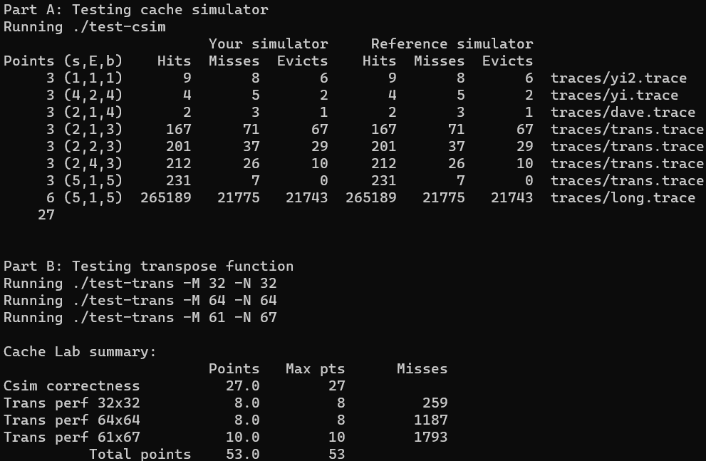

# 05 Cache Lab

## 文件内容

- 项目文件：`cachelab-handout` 
- 实现文件：`cachelab-handout-my`
    - Part A：`csim.c`
    - Part B：`trans.c`
    
- 相关说明教程：`guide`

## 如何运行

``` sh
# 在 cachelab-handout_my 目录下
./driver.py # 测试 Part A 和 Part B
./test-csim # 仅测试 Part A
./test-trans -M [num] -N [num] # 仅测试 Part B
```

## 题目分析

- `Part A` 要求实现采用 LRU (least-recently used) 替换原则的缓存命中计数器
- `Part B` 要求优化矩阵转置，尽可能减少 cache miss 数量

### Part A

这一部分比较简单，主要完成三个部分：获取命令行参数，文件读入与处理，缓存命中模拟。基本上理解了缓存原理都能很快实现，不必过多讲述。

### Part B

这一部分要实现一个矩阵转置函数，分别处理三种不同大小的矩阵

- 32 × 32 (M = 32, N = 32) `full points if misses < 300`
- 64 × 64 (M = 64, N = 64) `full points if misses < 1300`
- 61 × 67 (M = 61, N = 67) `full points if misses < 2000`

主要用到的策略是分块（Blocking），提高缓存利用率，避免不必要的替换。

> cache 参数：s = 5, E = 1, b = 5

#### 32 × 32

cache 大小为 1KB，一个缓存块能够存 8 个 int，所以矩阵每 8 行缓存块索引会冲突，自然想到分块大小为 8 × 8，又由于对角线块上 A，B 矩阵的缓存块会冲突，所以每个块中先将数据全部从 A 复制到 B，再转置就避免了冲突，达到理论最优解：`256 misses`

``` c
int iBlock, jBlock, i, j, reg0, reg1, reg2, reg3, reg4, reg5, reg6, reg7;
for (iBlock = 0; iBlock < N; iBlock += 8) {
    for (jBlock = 0; jBlock < M; jBlock += 8) {
        // copy
        for (i = 0; i < 8; ++i) {
            reg0 = A[iBlock + i][jBlock + 0];
            reg1 = A[iBlock + i][jBlock + 1];
            reg2 = A[iBlock + i][jBlock + 2];
            reg3 = A[iBlock + i][jBlock + 3];
            reg4 = A[iBlock + i][jBlock + 4];
            reg5 = A[iBlock + i][jBlock + 5];
            reg6 = A[iBlock + i][jBlock + 6];
            reg7 = A[iBlock + i][jBlock + 7];
            B[jBlock + i][iBlock + 0] = reg0;
            B[jBlock + i][iBlock + 1] = reg1;
            B[jBlock + i][iBlock + 2] = reg2;
            B[jBlock + i][iBlock + 3] = reg3;
            B[jBlock + i][iBlock + 4] = reg4;
            B[jBlock + i][iBlock + 5] = reg5;
            B[jBlock + i][iBlock + 6] = reg6;
            B[jBlock + i][iBlock + 7] = reg7;
        }
        // transpose
        for (i = 0; i < 8; ++i) {
            for (j = i + 1; j < 8; ++j) {
                reg0 = B[jBlock + i][iBlock + j];
                B[jBlock + i][iBlock + j] = B[jBlock + j][iBlock + i];
                B[jBlock + j][iBlock + i] = reg0;
            }
        }
    }
}
```

#### 64 × 64

如果依旧 8 × 8 分块，那么前四行与后四行缓存块会冲突，但 4 × 4 分块又对缓存利用率不足，达不到满分要求，因此仍选择 8 × 8 分块，但以 4 × 4 的小块进行数据转移，具体策略可以见代码，对于非对角线块消除了一切冲突，但对于对角线块没有做额外的优化，依旧存在冲突问题，最终结果：`1184 misses`，距离理论最优解还有一定的差距。

> 理论最优解做法可以参考这篇文章：[CSAPP - Cache Lab的更(最)优秀的解法](https://zhuanlan.zhihu.com/p/387662272)，非常巧妙的思路。

``` c
int iBlock, jBlock, i, j, reg0, reg1, reg2, reg3, reg4, reg5, reg6, reg7;
for (iBlock = 0; iBlock < N; iBlock += 8) {
    for (jBlock = 0; jBlock < M; jBlock += 8) {
        // copy upper 4 lines
        for (i = 0; i < 4; ++i) {
            reg0 = A[iBlock + i][jBlock + 0];
            reg1 = A[iBlock + i][jBlock + 1];
            reg2 = A[iBlock + i][jBlock + 2];
            reg3 = A[iBlock + i][jBlock + 3];
            reg4 = A[iBlock + i][jBlock + 4];
            reg5 = A[iBlock + i][jBlock + 5];
            reg6 = A[iBlock + i][jBlock + 6];
            reg7 = A[iBlock + i][jBlock + 7];
            B[jBlock + i][iBlock + 0] = reg0;
            B[jBlock + i][iBlock + 1] = reg1;
            B[jBlock + i][iBlock + 2] = reg2;
            B[jBlock + i][iBlock + 3] = reg3;
            B[jBlock + i][iBlock + 4] = reg4;
            B[jBlock + i][iBlock + 5] = reg5;
            B[jBlock + i][iBlock + 6] = reg6;
            B[jBlock + i][iBlock + 7] = reg7;
        }
        // transpose upper 4 lines
        for (i = 0; i < 4; ++i) {
            for (j = i + 1; j < 4; ++j) {
                reg0 = B[jBlock + i][iBlock + j];
                reg1 = B[jBlock + i][iBlock + j + 4];
                B[jBlock + i][iBlock + j] = B[jBlock + j][iBlock + i];
                B[jBlock + i][iBlock + j + 4] = B[jBlock + j][iBlock + i + 4];
                B[jBlock + j][iBlock + i] = reg0;
                B[jBlock + j][iBlock + i + 4] = reg1;
            }
        }
        // swap lower-left and upper-right, copy and transpose lower-right
        for (i = 0; i < 4; ++i) {
            reg0 = B[jBlock + i][iBlock + 4];
            reg1 = B[jBlock + i][iBlock + 5];
            reg2 = B[jBlock + i][iBlock + 6];
            reg3 = B[jBlock + i][iBlock + 7];
            B[jBlock + i][iBlock + 4] = A[iBlock + 4][jBlock + i];
            reg4 = A[iBlock + 4][jBlock + i + 4];
            B[jBlock + i][iBlock + 5] = A[iBlock + 5][jBlock + i];
            reg5 = A[iBlock + 5][jBlock + i + 4];
            B[jBlock + i][iBlock + 6] = A[iBlock + 6][jBlock + i];
            reg6 = A[iBlock + 6][jBlock + i + 4];
            B[jBlock + i][iBlock + 7] = A[iBlock + 7][jBlock + i];
            reg7 = A[iBlock + 7][jBlock + i + 4];
            B[jBlock + i + 4][iBlock + 0] = reg0;
            B[jBlock + i + 4][iBlock + 1] = reg1;
            B[jBlock + i + 4][iBlock + 2] = reg2;
            B[jBlock + i + 4][iBlock + 3] = reg3;
            B[jBlock + i + 4][iBlock + 4] = reg4;
            B[jBlock + i + 4][iBlock + 5] = reg5;
            B[jBlock + i + 4][iBlock + 6] = reg6;
            B[jBlock + i + 4][iBlock + 7] = reg7;
        }
    }
}
```

#### 61 × 67

不规则的矩阵没有采取特别的优化，还是用分块策略，进过一番测试后选择了 8 × 20 的分块大小，最终结果：`1790 misses`

在没有针对性特殊处理情况下，已经是相当不错的成绩了，可见分块策略的强大之处。

``` c
int iBlock, jBlock, i, j, reg0, reg1, reg2, reg3, reg4, reg5, reg6, reg7;
for (iBlock = 0; iBlock < N; iBlock += 8) {
    for (jBlock = 0; jBlock < M; jBlock += 20) {
        if (iBlock + 8 <= N && jBlock + 20 <= M) {
            for (j = 0; j <= 20; ++j) {
                reg0 = A[iBlock + 0][jBlock + j];
                reg1 = A[iBlock + 1][jBlock + j];
                reg2 = A[iBlock + 2][jBlock + j];
                reg3 = A[iBlock + 3][jBlock + j];
                reg4 = A[iBlock + 4][jBlock + j];
                reg5 = A[iBlock + 5][jBlock + j];
                reg6 = A[iBlock + 6][jBlock + j];
                reg7 = A[iBlock + 7][jBlock + j];
                B[jBlock + j][iBlock + 0] = reg0;
                B[jBlock + j][iBlock + 1] = reg1;
                B[jBlock + j][iBlock + 2] = reg2;
                B[jBlock + j][iBlock + 3] = reg3;
                B[jBlock + j][iBlock + 4] = reg4;
                B[jBlock + j][iBlock + 5] = reg5;
                B[jBlock + j][iBlock + 6] = reg6;
                B[jBlock + j][iBlock + 7] = reg7;
            }
        }
        else {
            for (i = iBlock; i < min(iBlock + 8, N); ++i)
                for (j = jBlock; j < min(jBlock + 20, M); ++j)
                    B[j][i] = A[i][j];
        }
    }
}
```

## 结果


