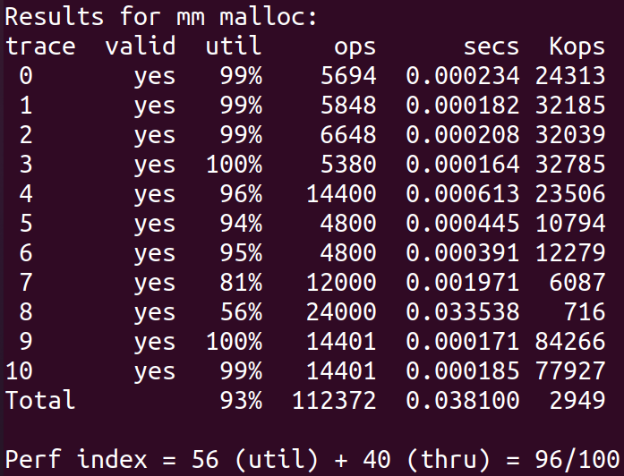

# 08 Malloc Lab

## 文件内容

- 项目文件：`malloclab-handout` 
- 实现文件：`malloclab-handout-my`
    - `mm.c`
- 相关说明教程：`guide`

> 注：本 lab 源文件不包含 `traces` 文件，可以在 `malloclab-handout-my` 中找到，复制到你的工作目录，并修改 `config.h` 第 15 行的路径

## 如何运行

``` sh
# 在 malloclab-handout_my 目录下
./mdriver # 仅显示总成绩
./mdriver -v # 显示各trace情况与总成绩
./mdriver -V # 显示最完整信息
```

## 题目分析

- malloc lab 要求我们写一个动态内存分配器，具体就是实现 `malloc`，`free`，`realloc` 的功能，同时尽可能高效，并提高空间利用率。
- 最终实现采用书上提到的“分离适配”方法（有一定程度参考学习了[这篇文章](https://zhuanlan.zhihu.com/p/374478609)的思路），简单来说就是将空闲块按照大小分到对应的集合中，每个集合中用显式空闲链表的方式连接起不同空闲块，这样在分配的时候只需要在某个集合（也就是整个堆的一小部分）中查找就行了，极大提高了搜索速度。
- 具体实现中，为了提高空间利用率，采取了最优匹配的策略，并且对空闲块立即合并。为了代码编写的便利，仿照书上的方法定义了一些宏。具体实现细节可以参考代码，注释写得相对详细。
- 要求中有个附加项是实现一个堆一致性检查器 `mm_checker()`，可以判断当前堆是否正常，并打印当前堆的内存结构，便于 debug。但由于实现上略有些繁琐~~（就是懒）~~，实际 debug 的过程还是使用临时打印关键信息的方式，并没有实现这一函数。

### 感想

虽然从原理上来说比较简单，但由于对内存的操作相对底层，很多时候都是位级的运算，因此一有不当心就是 Segmentation Fault（万恶之源！），而且正如书上所说的那样，与内存有关的错误在时间和空间上，经常在距离错误源一段距离之后才表现出来，因此 debug 起来十分困难。我自己就因为一个比较愚蠢的问题，导致代码能过个别数据点，但另外几个就会运行错误，debug 好久才发现问题，回头一想才觉得应该很早就能发现的，更说明了静态查错的重要性~~（虽然当时也查了，没查出来）~~。总之，这次 lab 还是让我对动态内存分配有了比较深刻的认识，也提高了一些写代码技术（也许吧）。

## 结果


